# AI Assistance Declaration: Network Setup, Firewall Configuration, Security Hardening & Traffic Analysis (Sections 4.1.2–4.2.2)

**Declared by:** Hans Danford (s0021018), DST-Group-1, COIT20246 T2 2026
**Tool used:** Claude (Anthropic), Cowork/Claude Code session

I'm writing this to disclose where and how I used AI across the Network Setup, Firewall Configuration, Security Hardening and Traffic Analysis tasks (4.1.2–4.2.2), in line with the Project Specification's Generative AI use requirement (Section 5.3), which asks me to acknowledge AI as a source when it provided "key knowledge." I also want to give Graham, and the marker if it comes up, a concrete and honest record of how I actually worked with it. That includes one place (4.1.2) where my first pass didn't fully meet that standard and I had to go back and fix it, not just a list of web links.

## How I actually used it

For almost all of the practical work below (running commands on the OpenWRT VM, editing UCI/firewall config, generating keys, capturing traffic, taking screenshots, and writing the explanations that appear in `network.md` and `harden.md`), I did the work myself, on my own machine, using my own SSH sessions and my own Wireshark install. Claude's role throughout was:

1. Suggesting diagnostic and configuration **commands** for me to run myself and paste real output back from.
2. **Explaining** what that real output meant (e.g. what a `netstat`/`uci`/`ps`/`ip addr` listing was showing, how SSH key auth actually works under the hood, how VirtualBox adapters map to VM interfaces).
3. **Reviewing** drafts of my own written explanations, checking for factual accuracy and completeness without writing the explanations for me.
4. **Checking** screenshots I'd already taken against what the task required, and flagging when one didn't actually demonstrate the intended point.

One section did not follow that pattern cleanly the first time. For 4.1.2, an earlier planning document Claude produced for me included a fully pre-written paragraph ("use something like this") that I ended up committing to `network.md` essentially word-for-word. On 24 Sep 2026, while reviewing whether the AI help across the whole project had been appropriate, this was flagged directly by Claude, unprompted by any specific check I'd asked for on that particular paragraph, as closer to the spec's example of unacceptable use ("copying AI-generated text into the report without critical evaluation, modification, and acknowledgment") than the pattern everywhere else in this project. I had it rewritten properly before submission; the full story, including the mistake, is in section 0 below, because I'd rather disclose that honestly than leave it looking cleaner than it was.

Aside from that one case, I didn't submit any task explanation, risk-assessment content, or diagram generated by AI as-is; all the written analysis in `network.md` and `harden.md` is my own wording, arrived at either by writing it myself from the start or, in the 4.1.2 case, by rewriting it myself after the issue was caught.

---

## 0) Network Setup: Explaining the Host-to-OpenWRT Connection (4.1.2)

The practical investigation behind this section was mine: I identified `eth0`/`eth1` and their VirtualBox adapter mapping from my own Week 3/4 `ip addr` output, took the VirtualBox Settings → Network screenshots for both adapters, confirmed the MAC-address match between each adapter and its VM interface, ran `ping 192.168.56.2` from the Windows host, and hand-drew the `.drawio` lab diagram myself in draw.io (per the project's AI-use policy that diagrams must be student-drawn).

Where this section didn't follow the same pattern as the rest of the project: back on 6 Sep 2026, in a planning document Claude built to help me work through the 4.1.2 task, it included a complete pre-written paragraph explaining the host-to-OpenWRT connection, explicitly labelled "use something like this." I committed that paragraph into `network.md` essentially word-for-word. That's AI-generated explanation text going into the report without me putting it in my own words first, a different and less acceptable pattern than everywhere else in this project.

**How it was caught and fixed (24 Sep 2026):** I asked Claude to review the AI help across the whole 4.1 section for appropriateness. It checked `network.md` directly against its own earlier draft, found the match, and flagged it to me unprompted, including naming the specific line in the spec's unacceptable-use list it was closer to. It also flagged a smaller, lower-risk item at the same time: the fictional business website content (`index.html`: business name, tagline, services copy, footer) from the same planning document, which Claude also fully wrote, but which was never committed to the report or markdown files. It only exists as live config on the OpenWRT VM, evidenced by a screenshot.

To fix the paragraph properly, Claude broke it into six factual questions, one for each fact the paragraph made, covering exactly the material I'd already verified myself (which interfaces map to which adapters, how I confirmed it, how each interface got its IP, where the host sits, whether NAT/routing is needed between host and router, and which tools rely on that path). I answered all six in my own words, and it took three review rounds before they were accurate:

- **Round 1:** I gave `eth1` the wrong MAC address (I'd copied `eth0`'s), and left out the adapter type (Host-only vs NAT) and how `eth1`'s IP was actually assigned.
- **Round 2:** I pulled up my actual VirtualBox screenshots and corrected the MAC address.
- **Round 3:** the MAC was still wrong in question 1, and more importantly, I'd written that the host and OpenWRT "communicate with NAT," which is backwards: they're on the same subnet and don't need NAT at all (NAT is what `eth1`/WAN uses). Claude caught this as a real conceptual error, not just a wording issue, and I corrected it.
- **Round 4:** all six answers checked out, with the correct MAC, adapter types named, the DHCP-vs-static distinction included, the NAT/Layer 2 explanation fixed, and Wireshark added to the tools list in question 6.

Claude then combined my six verified answers into one paragraph. This was purely formatting of content that was already mine and already correct, not new substance, and I made a few final wording edits of my own before committing it. The paragraph that replaced the original AI-drafted one in `network.md` is:

> "OpenWRT has two network interfaces in this VM, eth0 and eth1, each mapped to a different VirtualBox adapter. eth0 is connected to Adapter 1 (Host-only Adapter) and acts as the port for the br-mng (management) interface, and it shares the same MAC address as br-mng (08:00:27:e3:5f:8f), confirming the match. br-mng is statically assigned 192.168.56.2. eth1 is connected to Adapter 2 (NAT), with MAC address 08:00:27:6f:f5:f5, and is dynamically assigned 10.0.3.15/24 from VirtualBox's NAT engine and simulates OpenWRT's WAN port. The Windows host itself sits at 192.168.56.1, the first address in the same 192.168.56.0/24 network as br-mng. Because the host and br-mng are on the same subnet, they do not need NAT or routing to communicate. They reach each other directly at Layer 2, confirmed by successfully pinging 192.168.56.1 from within the OpenWRT router. This host-to-OpenWRT path is what SSH, browsing the web pages hosted on the router, and Wireshark (used to inspect the HTTP, ICMP, and SSH traffic between the two) all rely on."

I'm disclosing this in full, including the mistake, rather than just quietly submitting the corrected version, because I think an honest account of catching and fixing it is worth more than pretending the first draft never happened.

## 1) Firewall Configuration (4.1.3)

I ran all the commands myself over SSH, creating and testing the HTTP-block, SSH-port-change, ICMP-block, and LuCI-management-block firewall rules. The write-up prose in `network.md`, including the troubleshooting narrative about the `mng`/`lan` firewall-zone mismatch and the reasoning for changing the SSH port, is in my own words. Claude didn't draft any of that text for me. When I asked Claude to check this section on 24 Sep 2026 (at the same time as the 4.1.2 review above), it confirmed the section followed the same acceptable pattern as the rest of the project and found no pre-written text reused in it.

## 2) SSH Key-Based Authentication (4.2.1, step 3)

I generated my own RSA key pair in MobaKeyGen, configured `authorized_keys` on the router myself, and confirmed key-based login worked (screenshots: `4_2_1_3_NewSSHKeyGen.png`, `4_2_1_3_NewSSHKey.png`, `4_2_1_3_NewSSH-NewSession.png`).

In my first draft explanation I stated that the *private key* is shared with the remote host during login. Claude flagged this as factually backwards: the private key never leaves the client; the server challenges the client, the client signs the challenge with its private key, and the server verifies the signature using the public key it already holds. I rewrote the explanation myself; the corrected version that appears in `harden.md` is my own wording:

> "Key based authentication requires a pair of cryptographically linked files, a public key and private key. The client generates the public and private key pair. It then shares the public key with the remote host, configuring the remote system to accept connections associated with that key. When the client connects to the host via ssh the remote host challenges the client and the client uses its private key to produce a cryptographic signature to prove its identity and establish the ssh connection. Key based authentication eliminates transmission of password secrets across the network entirely. Unlike passwords key pairs are long and complex which makes them difficult to be cracked by guessing or brute force."

## 3) Disabling an Unnecessary Service: LuCI (4.2.1, step 4)

I ran the actual diagnostics myself (`netstat -tlnp`, `uci show firewall`, `uci show uhttpd`, `ps`) and pasted the real output back for Claude to walk through, line-by-line, explaining what each process and listening port represented.

I initially reasoned that port 444 was running "SNPP" based on the IANA port registration. Claude pointed out that the port number alone doesn't tell you what's actually running. The `ps` output showed the process on that port was `uhttpd` (LuCI's HTTPS listener), not SNPP; ground truth comes from the running process, not the port registry. This corrected my reasoning and led to my final decision.

Claude also confirmed, by checking the actual Week 10 lecture/tutorial materials and the Project Specification itself, that (a) there was no explicit example list of "services to disable" in the course materials, and (b) no later project task depends on LuCI/web-GUI access, which de-risked my decision to disable it entirely rather than just the one port already blocked by the existing firewall rule.

I then ran the actual `uci delete` / `uci commit` / `/etc/init.d/uhttpd restart` commands myself and verified the result (screenshots: `4_2_1_4_LuCI-Before.png`, `4_2_1_4_LuCI-Before1.png`, `4_2_1_4_LuCI-After.png`, `4_2_1_4_LuCI-After-BusinessSite-OK.png`). My first written explanation only covered port 81 and gave circular reasoning; Claude flagged the gap (it didn't cover port 444, and didn't explain a concrete attack it prevents). My revised, final explanation in `harden.md` is my own wording:

> "After review of current settings and features, it was decided that the web GUI management (LuCI) path was the service to be disabled as access to openwrt management can be done through Unified Configuration Interface (uci) via ssh. In a previous network task a firewall rule was created to `REJECT` traffic to the LuCI on port 81. This was accomplished by removing http listening services on port 81 and 444 using `uci delete uhttpd.main.listen_http` and `uci delete uhttpd.main.listen_https` commands in the ssh session and restarting the http service. Disabling this feature altogether reduces the potential attack surfaces for the router by ensuring that there is no live authentication endpoint for targeted credential attacks."

## 4) Traffic Analysis: HTTP and SSH Capture (4.2.2)

I ran the actual capture commands on the router myself:

```
root@OpenWrt:~# tcpdump -i br-mng -w /tmp/http-capture.pcap port 80
root@OpenWrt:~# tcpdump -i br-mng -w /tmp/ssh-capture.pcap port 2222
```

and opened both `.pcap` files in my own Wireshark. I shared two screenshots of the SSH capture with Claude for a sanity check before finalizing. The first showed packet 11, a **Key Exchange Init** packet, filtered on `tcp.port==2222`. Claude flagged that this specific packet was the wrong one to use as evidence: a Key Exchange Init happens *before* encryption is established, so it still shows cipher/MAC algorithm names in readable text (e.g. `aes256-ctr`, `hmac-sha2-256`), which would actually undercut the point the task asks students to make. Claude explained specifically what to look for instead: a later packet whose Info column reads "Encrypted packet," where the hex/ASCII pane shows no readable strings. I then went back into Wireshark myself and found packet 19, which I confirmed as the correct example.

My final written analysis in `harden.md` (my own wording, after review for accuracy on the "verbosity" phrasing and a typo) reads:

> HTTP: "Using wireshark we can see that the http packet capture reveals a lot of information in the network traffic. When examining the captured network traffic, we can clearly see elements like the ip addresses of the router `192.168.56.2` and my machine `192.168.56.1` as well as the url and even the html of the web page that shows our student id's and names. An attacker with a packet sniffer on the same network can read all this http traffic in the network traffic."
>
> SSH: "In contrast to the http traffic inspected earlier, ssh network traffic is not readable. The encrypted packet under the SSH protocol has no plain text information like the http traffic. This is by design as the ssh traffic is encrypted end to end and would-be attackers sniffing network traffic would not be able to find information in the intercepted packets such as user passwords or terminal commands."

---

## Summary for citation purposes

Where the spec (Section 5.3) asks me to acknowledge a source when AI provided "key knowledge," my source across this project's network setup, firewall, hardening and traffic-analysis write-ups is: **Claude (Anthropic), used interactively for command guidance, concept explanation, and accuracy review of my own draft explanations.** For nearly all of it, that stayed strictly on the "review my own wording" side of the line. One exception exists and is disclosed in full above: the original 4.1.2 write-up paragraph was AI-drafted and briefly committed near-verbatim before being caught and properly rewritten in my own words on 24 Sep 2026. This declaration is my disclosure/citation record; the underlying practical work (commands run, screenshots taken, keys generated, explanations written or rewritten) is my own, as reflected in the actual repository history, `network.md`, and `harden.md`.

---

## Appendix: Verbatim Chat Excerpts

### Network Setup: Catching and Correcting AI-Drafted Text (4.1.2)

This exchange is reproduced exactly as sent/received from the Cowork session, 24 Sep 2026.

**Claude (unprompted, after I asked it to review whether the AI help across 4.1 had been appropriate):** "Good catch — I checked, and there's a real difference between the two 4.1 sections. **4.1.3 (firewall rules) — clean**... **4.1.2 (network setup) — one real issue.** In the execution guide I built for you back on 6 Sep, section 2 ('Explaining the host-to-OpenWRT connection') gave you a complete pre-written paragraph, explicitly labeled 'use something like this.' I just compared it against what's actually committed in `network.md`, and it's there essentially word-for-word... That does land closer to the spec's unacceptable-use example — 'copying AI-generated text into the report without critical evaluation, modification, and acknowledgment' — than the acceptable pattern... **What I'd suggest:** rewrite that one `network.md` §2 paragraph yourself, in your own words, the same way you did for the SSH key-auth and LuCI explanations..."

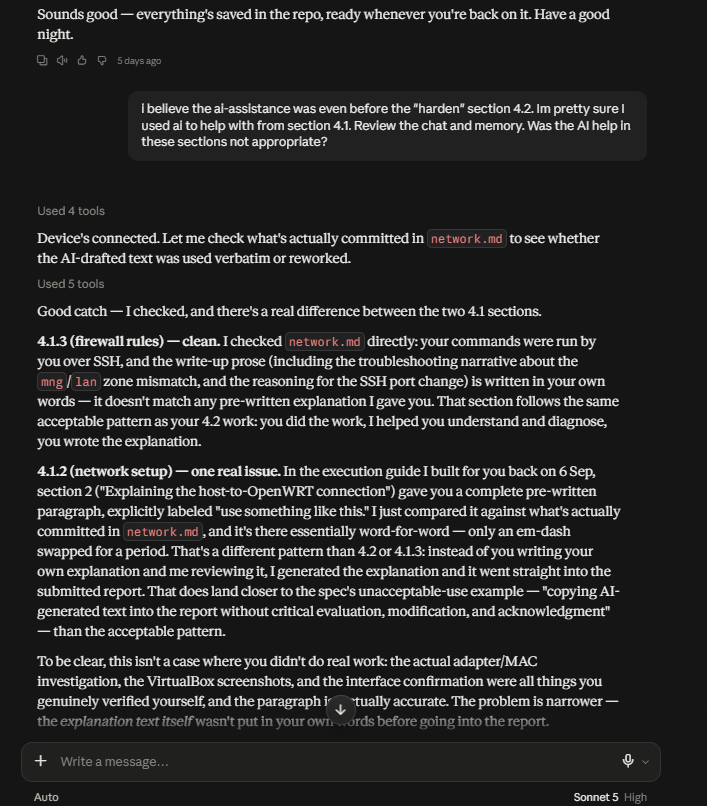
*Screenshot 09: Claude flags the 4.1.2 paragraph and confirms 4.1.3 is clean (24 Sep 2026)*

**Me:** "yes, go ahead and pull up that specific paragraph"

**Claude:** [quoted the original AI-drafted paragraph, then] "This is basically what I drafted for you word-for-word. The good news is all the underlying facts in it are accurate and yours (the MAC addresses, the adapter mapping, the ping/ARP confirmation) — it just needs to go through the same process the rest of your report went through: you explaining it in your own sentences."

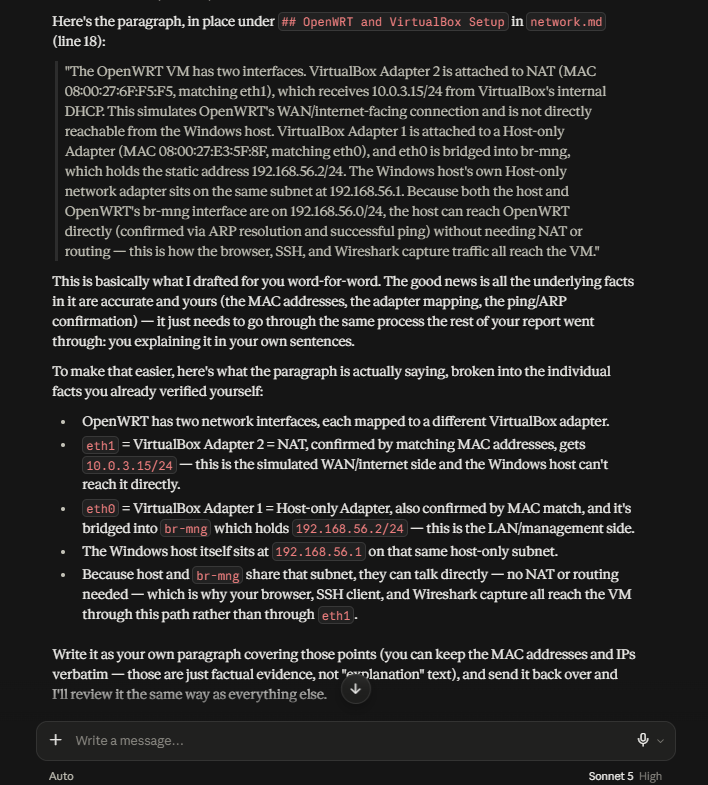
*Screenshot 08: the original AI-drafted paragraph pulled up and flagged as word-for-word*

**Me:** "Ok. Give me a question for each of the points, so that I can answer them and then these responses can be combined into a complete write up replacement for that paragraph."

**Claude:** "Here are five questions — answer each in a sentence or two, in your own words... **1.** OpenWRT has two network interfaces in this VM, each mapped to a different VirtualBox adapter. What are they, and how did you confirm which VirtualBox adapter each one corresponds to? **2.** What is `eth1` connected to... **3.** What is `eth0` connected to... **4.** Where does the Windows host itself sit on this network... **5.** Given the host and OpenWRT's management interface are on the same subnet, what does that mean for how they communicate (does it need NAT or routing?)... **6.** Practically speaking, which tools/activities in your project (browser, SSH, Wireshark) actually rely on this host-to-OpenWRT path you just described?"

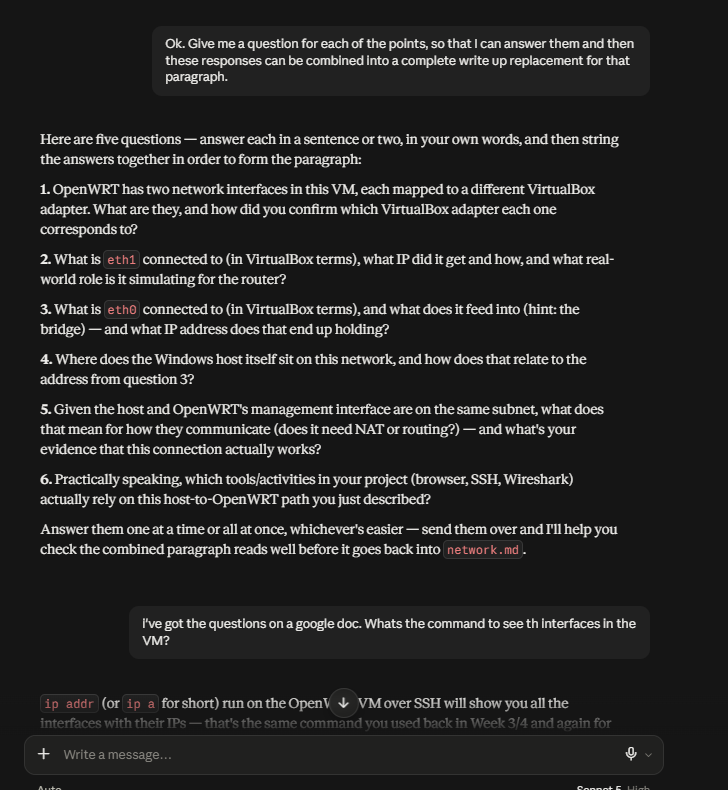
*Screenshot 07: Claude's question breakdown (six numbered questions)*

**Me (round 1 answers, questions 1–3):** "There are two interfaces, eth0 and eth1. Virtual adapter 1 or eth0 interface is the port for the br-mng virtual interface used to access the router management via 192.168.56.2. The eth0 shares the same mac address as br-mng (08:00:27:e3:5f:8f). Virtual adapter 2 or eth1 on the other hand share the same mac (08:00:27:e3:5f:8f) and the 10.0.3.15/24 ip network, which is used for WAN."

**Claude:** "Good structure, but there's a factual slip and a couple of gaps to fill... **The MAC for eth1 is wrong.** You wrote that eth1 shares MAC `08:00:27:e3:5f:8f` — that's eth0's MAC... eth1's actual MAC is `08:00:27:6f:f5:f5` — different address entirely... **Adapter type isn't named for either interface**... **How eth1 got its IP isn't covered.**"

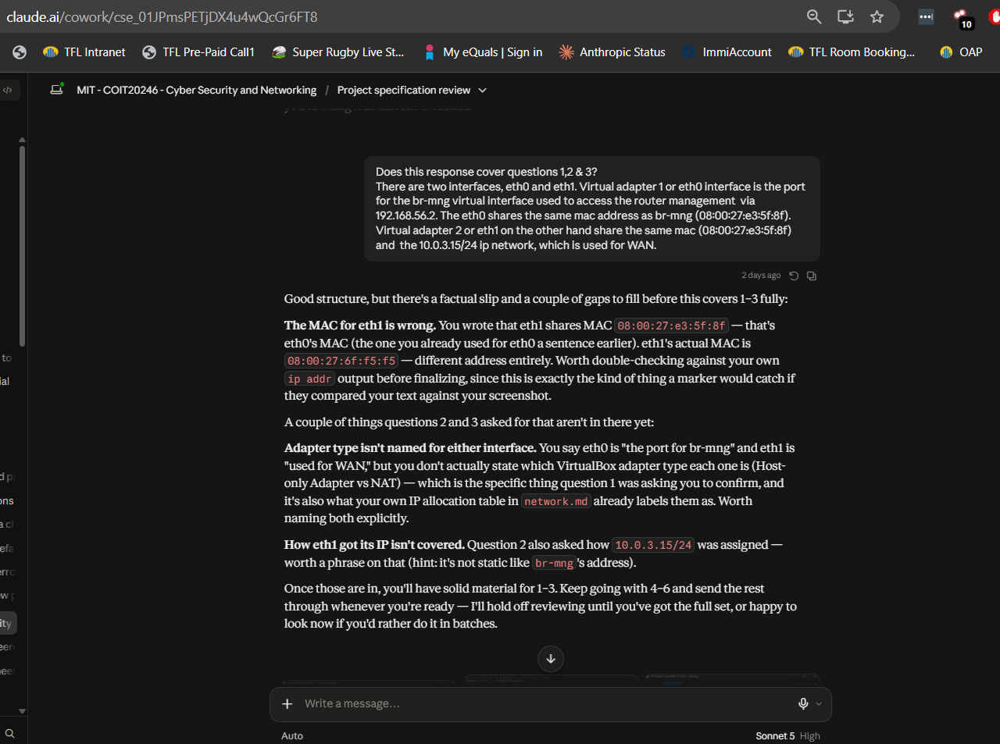
*Screenshot 06: round 1 review, catching the wrong MAC for eth1*

**Me:** "im not entirely sure that that is correct. Here's snips." [screenshots of VirtualBox Adapter settings]

**Claude:** "Good instinct to pull fresh evidence — and it confirms exactly what I flagged... So your original answer had it backwards on the MAC — you wrote `08:00:27:e3:5f:8f` for eth1, but that's actually eth0/br-mng's MAC. eth1's real MAC is `08:00:27:6f:f5:f5`..."

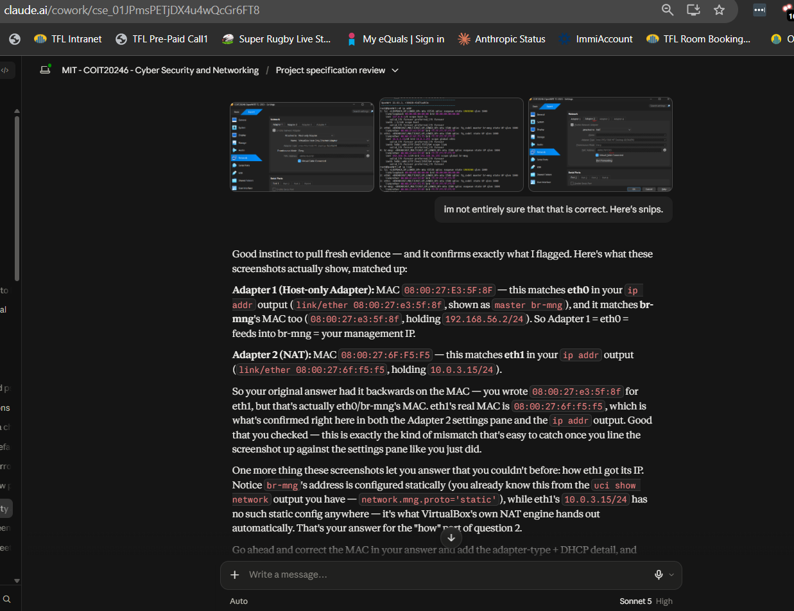
*Screenshot 05: me supplying VirtualBox adapter screenshots as fresh evidence*

**Me (round 2, full six answers):** "...5. Given the host and OpenWRT's management interface are on the same subnet, what does that mean for how they communicate (does it need NAT or routing?)... The communicate with NAT and i am able to ping 192.168.56.1 from within the OpenWRT router..."

**Claude:** "Good on 3, 4, and 6 for the most part — but a few things still need fixing before this is solid, and one is a real conceptual error worth catching before it goes in the report... **#5 — this one's backwards, and it's the most important catch here.** You wrote 'they communicate with NAT' — but the whole reason host and OpenWRT's management interface can talk directly is that NAT is *not* involved. NAT is what eth1 (the WAN/simulated-internet side) uses. The host and `br-mng` are on the same subnet (`192.168.56.0/24`), so they reach each other directly at Layer 2 — no NAT, no routing needed. Your ping evidence is good (that's the right proof), but the explanation attached to it currently states the opposite of what's actually true."

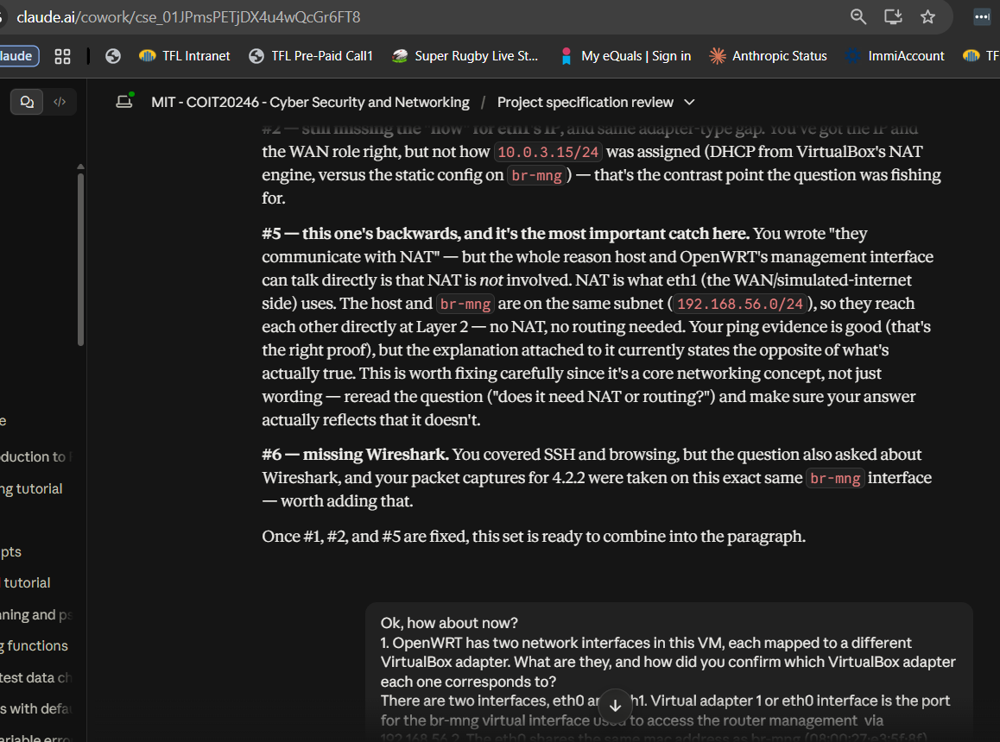
*Screenshot 04: the NAT/Layer 2 conceptual error caught*

**Me (round 3, final answers):** "...5. ...They do not use NAT or routing to communicate. The host and br-mng are on the same subnet and communicate directly on Layer 2. I am able to ping 192.168.56.1 from within the OpenWRT router. 6. ...This host-to-OpenWRT path is used for SSH and also how we are able to browse the web pages hosted on the router. Wireshark was also used to inspect the http, icmp and ssh traffic between the two."

**Claude:** "Paragraph swapped in. Here's the final section as it now reads in `network.md`:" [final section shown] "That's Question 1 done — all six questions in this section now check out, with only the paragraph under \"OpenWRT and VirtualBox Setup\" changed and everything else in `network.md` left exactly as it was." [I then lightly edited the paragraph myself in `network.md`]

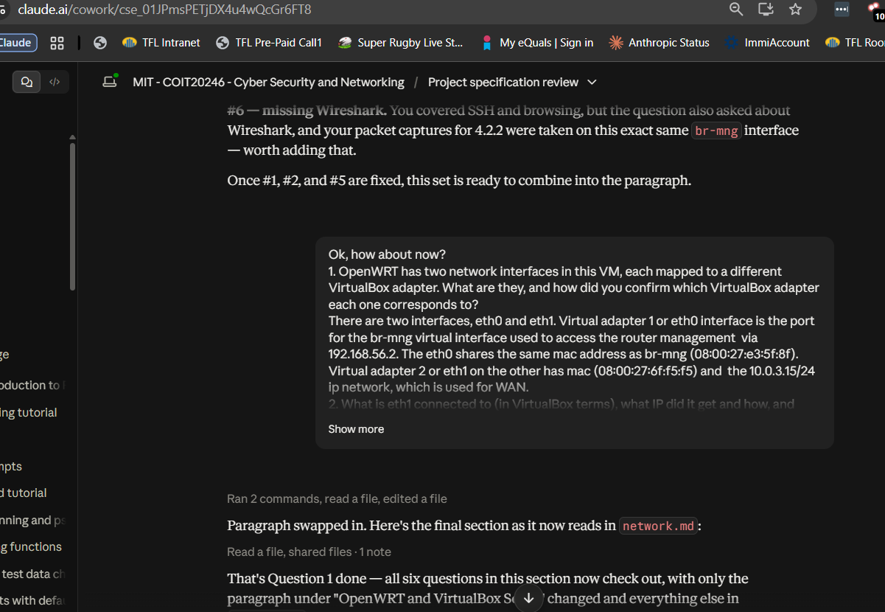
*Screenshot 03: all six answers checked, paragraph swapped into network.md*

**Claude (after I committed my lightly edited version to `network.md`):** confirmed the committed paragraph was my merged answers with my own light touch-ups and that every fact checked out.

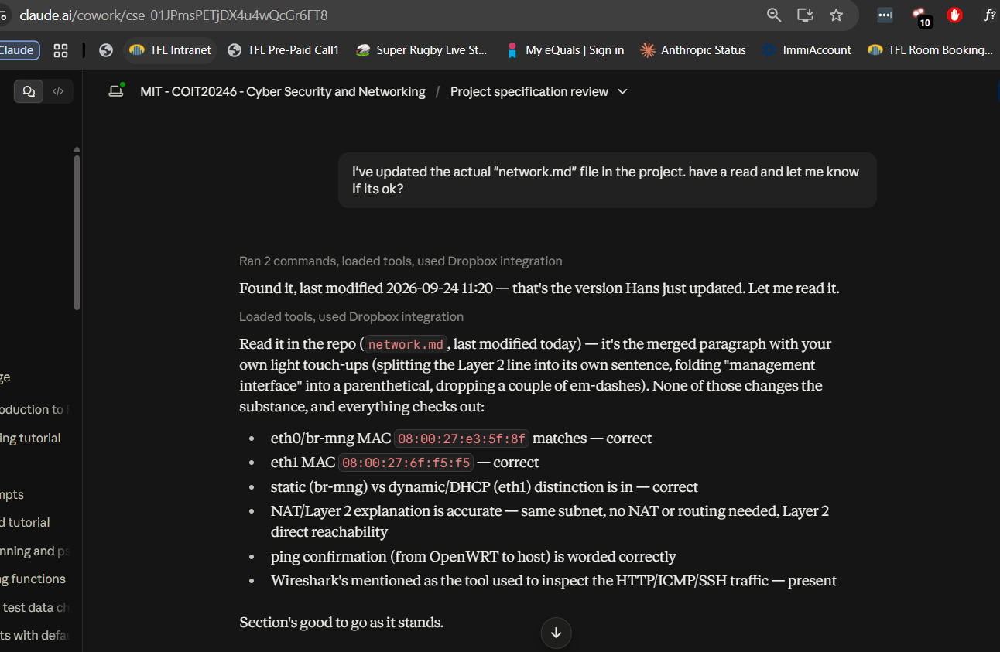
*Screenshot 02: Claude confirming the committed network.md paragraph*

### Traffic Analysis review (4.2.2)

A quick note on format: this is copy-pasted text from my actual Claude session, with screenshots of the same exchanges in the chat window added under each one. The exchanges below are quoted exactly as they were sent/received, trimmed only to remove the two attached screenshot images themselves (described in brackets).

**Me:** [screenshot: Wireshark, `ssh-capture.pcap`, filter `tcp.port==2222`, packet 11 selected] "is this good enough?"

**Claude:** "Good progress on getting into Wireshark with the filter applied — but this particular packet isn't quite the strongest one for your write-up... packet 11 is a Key Exchange Init packet. That happens *before* encryption is actually established — it's SSH negotiating which cipher/MAC/compression algorithms to use, so it's expected to still contain plaintext-readable strings (you can see `aes256-ctr`, `hmac-sha2-256`, `curve25519-sha256`, etc. sitting right there in the detail pane)... What you want instead is a packet from *after* the key exchange completes — scroll further down the packet list until you see entries where the Info column just says something like 'Client: Encrypted packet (len=...)'... look at the hex/ASCII pane at the bottom: instead of readable strings, you should see essentially random-looking bytes with no recognizable ASCII text at all."

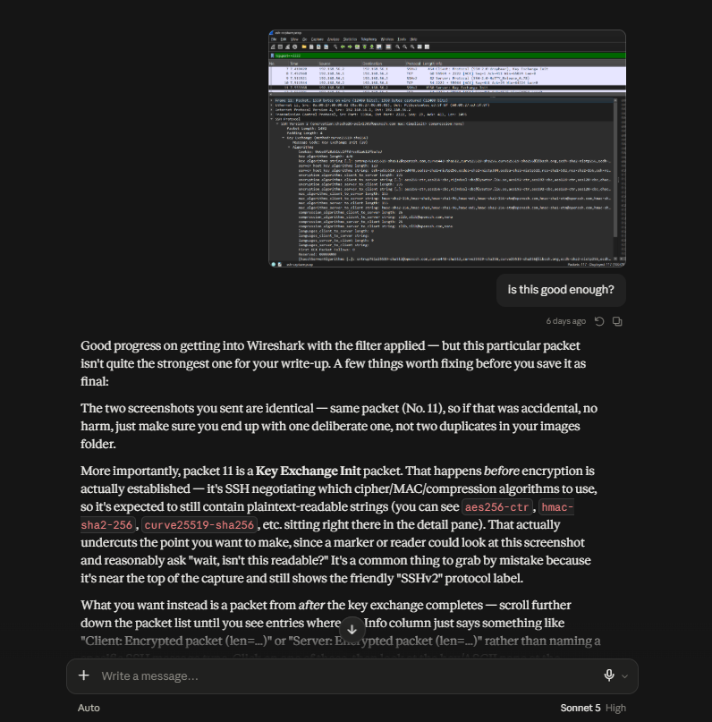
*Screenshot 10: my first Wireshark screenshot (packet 11, Key Exchange Init) and Claude's review*

**Me:** [screenshot: Wireshark, packet 19 selected, "Encrypted Packet"] "how about this?"

**Claude:** "Yes — that's exactly it. Packet 19 is a post-key-exchange 'Encrypted packet,' and the payload data (`267e05df...`) and the ASCII column on the right are pure noise — no readable strings, no protocol structure Wireshark can even dissect beyond 'Encrypted Packet' and the MAC. That's a clean, real contrast against your HTTP screenshot where `GET / HTTP/1.1` was sitting there in plain text."

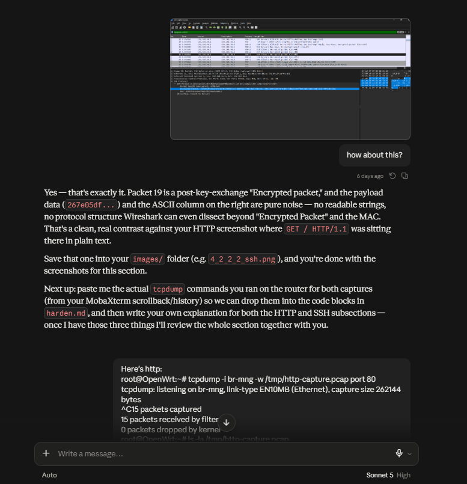
*Screenshot 11: packet 19 confirmed as a post-key-exchange encrypted packet*

**Me:** [pasted real terminal output] "Here's http: `root@OpenWrt:~# tcpdump -i br-mng -w /tmp/http-capture.pcap port 80` ... And ssh: `root@OpenWrt:~# tcpdump -i br-mng -w /tmp/ssh-capture.pcap port 2222` ..."

**Me:** "i've added my answers. review and let me know if im tracking?"

**Claude:** "Good work overall — the core idea is right in both, but a couple of accuracy/completeness gaps to tighten up before this is done... The task explicitly asked you to also call out source/destination IPs as part of what's visible in plaintext... 'ssh network traffic is not verbose' is the one line I'd push back on — it's not quite accurate. Your SSH capture actually had *more* packets than the HTTP one (117 vs 15), so 'not verbose' could read as a factual slip..."

**Me:** "Does it track now?"

**Claude:** "Yes, this tracks well now — both fixes from last round are in... One thing to fix before you call it done: there's a typo/spacing glitch in 'would-be at   tackers'..."

**Me:** "sorted"

**Claude:** "Confirmed — the typo's fixed, 'would-be attackers' reads clean now. Section 4.2.2 is complete and accurate."

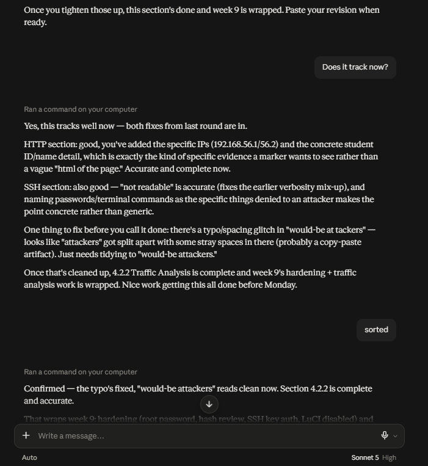
*Screenshot 12: final sign-off on 4.2.2 after the typo fix*

*(A note on the SSH key-authentication and LuCI-disable sections above (2 and 3): that portion of the conversation happened earlier in this same Claude session, before a context-length "compaction". Claude's own working memory of the exact exchanges was condensed into a summary rather than kept verbatim, which is why those two sections are accurately described above rather than quoted directly. The messages themselves should still be visible by scrolling further back in that same Cowork conversation thread if I want verbatim screenshots of those too.)*

---

I confirm the above is an accurate account of how I used AI on this part of the project.

**Hans Danford**
