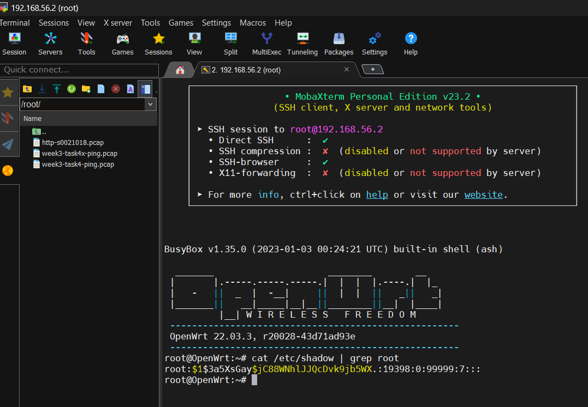
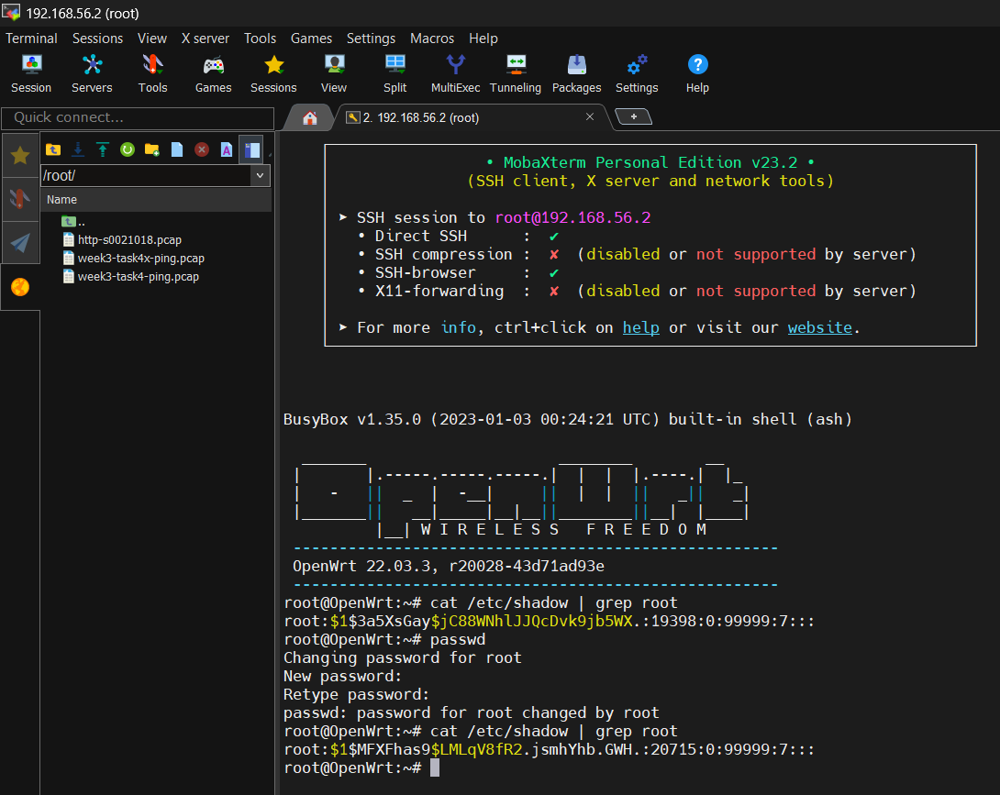
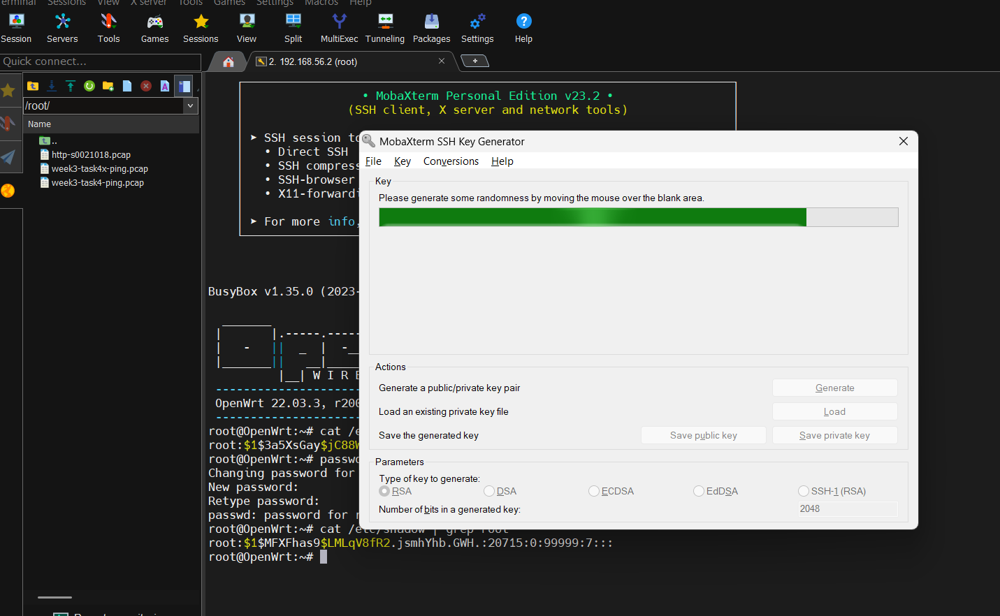
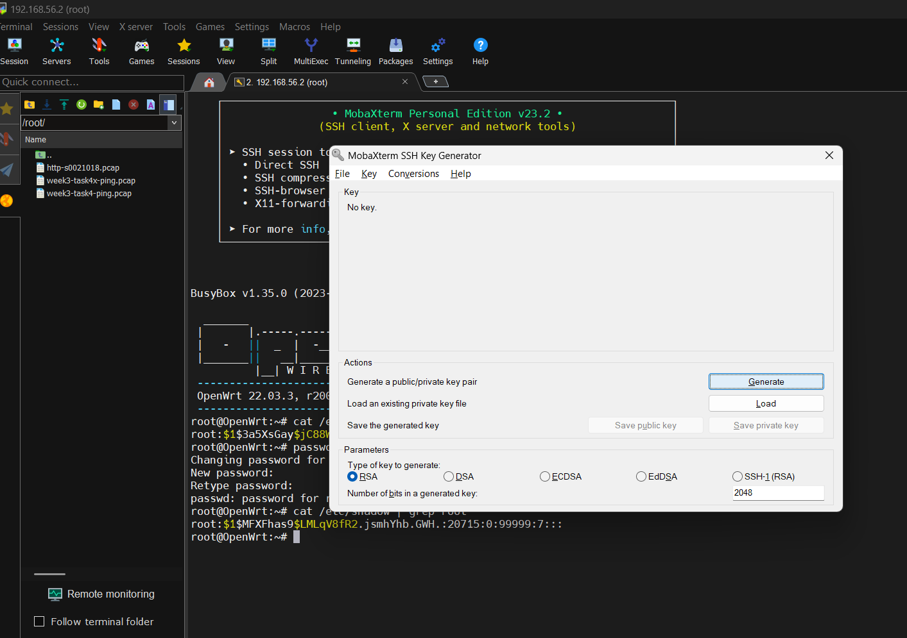
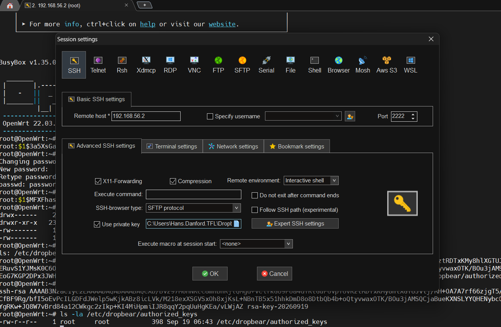
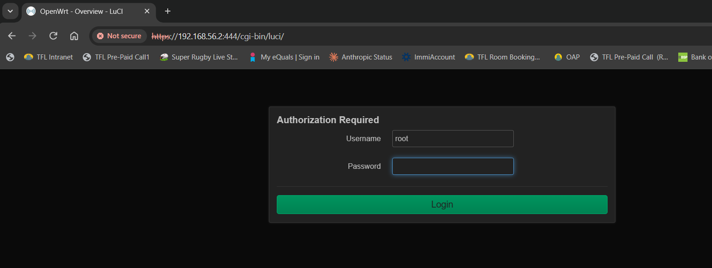
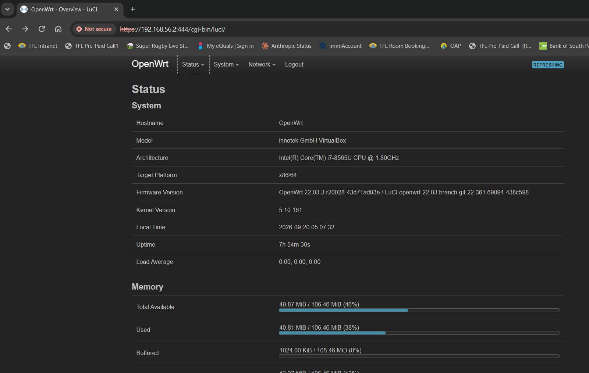
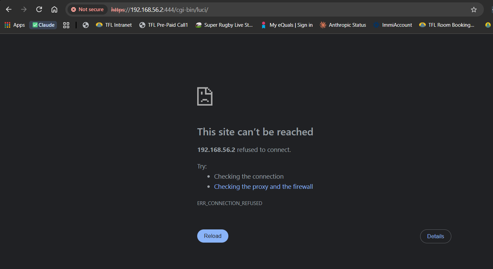
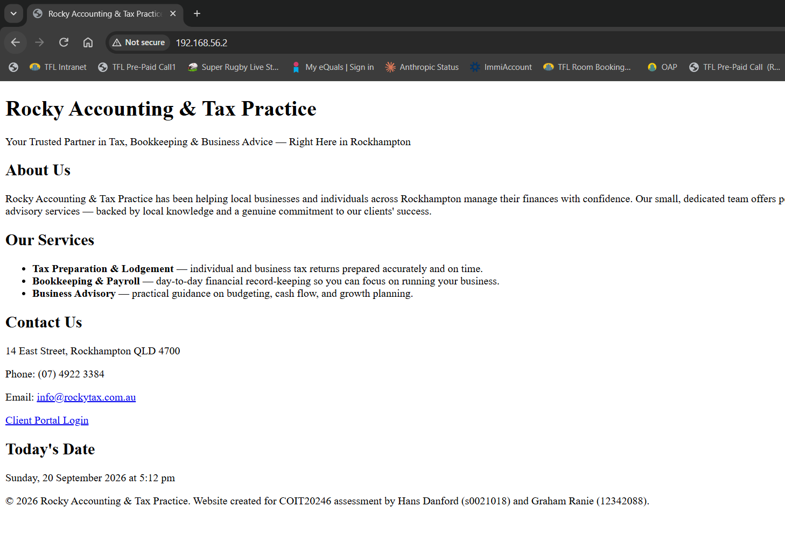

# Security Hardening and Traffic Analysis

## Harden the OpenWRT System

### 1) Change Default Root Password



```
root@OpenWrt:~# cat /etc/shadow | grep root
root:$1$3a5XsGay$jC88WNhlJJQcDvk9jb5WX.:19398:0:99999:7:::
root@OpenWrt:~# passwd
Changing password for root
New password:
Retype password:
passwd: password for root changed by root
root@OpenWrt:~# cat /etc/shadow | grep root
root:$1$MFXFhas9$LMLqV8fR2.jsmhYhb.GWH.:20715:0:99999:7:::
```



Changing the default/known root password is best practice when securing a device's administrator access. This makes it harder for attackers to gain access to devices like routers which usually come with standard admin username and password. This info is often detailed in the product documentation and sometimes even written on the device.

### 2) Examine Password Storage (Hash Algorithm)

For this OpenWRT installation the encryption used is `MD5-crypt` denoted by the `$1$` in the beginning of the password. For the change in password this encryption remained the same for the new password i.e `$1$`. The encryption is followed by the `salt` and `$`. The salt is a random string that is combined with the password before it gets hashed. In this scenario the original salt has changed from `3a5XsGay` to `MFXFhas9` for the new password. Changing the `salt` means users with the same password return different hash values of their password. Finally the password is represented as a hash value and not plain text. Hashing is a one way operation and a would be attacker would not be able to decrypt or reverse this operation to get the password.

### 3) SSH Key-Based Authentication





```
root@OpenWrt:~# ls -la /etc/dropbear/authorized_keys
ls: /etc/dropbear/authorized_keys: No such file or directory
root@OpenWrt:~# echo "ssh-rsa AAAAB3NzaC1yc2EAAAADAQABAAABAQCXb/BVz97M0HNKcC8mhbnKjlQMgd+VCifkGU9PUa4dTKtGuP6VpTUvKztRDTxKMy8hlXGTUJVlj/RH+OA7A7rf66zjgT5/D27BERuvS1YJMsK0C6OkLT8DwbCfBF9Rg/bfI5oEvPcILGDFdJWelp5wKjkABz8icLVk/M218exXSGVSxOh8xjKsL+NBnTB5x51hhkDmD8o8DtbQb4b+oQtyvwaxOTK/BOu3jAMSQCjaBueKXNSLYYQHENybcChySoEoG7KGP2DPx3JWHOPtHndXYgRKw+JQ8W7vBrd84a12CWkgc2zIkp+KI4MiHpmiIJR8qqY2pqUuHgKEa/vLWjAZ rsa-key-20260919" >> /etc/dropbear/authorized_keys
root@OpenWrt:~# cat /etc/dropbear/authorized_keys
ssh-rsa AAAAB3NzaC1yc2EAAAADAQABAAABAQCXb/BVz97M0HNKcC8mhbnKjlQMgd+VCifkGU9PUa4dTKtGuP6VpTUvKztRDTxKMy8hlXGTUJVlj/RH+OA7A7rf66zjgT5/D27BERuvS1YJMsK0C6OkLT8DwbCfBF9Rg/bfI5oEvPcILGDFdJWelp5wKjkABz8icLVk/M218exXSGVSxOh8xjKsL+NBnTB5x51hhkDmD8o8DtbQb4b+oQtyvwaxOTK/BOu3jAMSQCjaBueKXNSLYYQHENybcChySoEoG7KGP2DPx3JWHOPtHndXYgRKw+JQ8W7vBrd84a12CWkgc2zIkp+KI4MiHpmiIJR8qqY2pqUuHgKEa/vLWjAZ rsa-key-20260919
root@OpenWrt:~# ls -la /etc/dropbear/authorized_keys
-rw-r--r--    1 root     root           398 Sep 19 06:43 /etc/dropbear/authorized_keys
```



Key based authentication requires a pair of cryptographically linked files, a public key and private key. The client generates the public and private key pair. It then shares the public key with the remote host, configuring the remote system to accept connections associated with that key. When the client connects to the host via ssh the remote host challenges the client and the client uses its private key to produce a cryptographic signature to prove its identity and establish the ssh connection. Key based authentication eliminates transmission of password secrets across the network entirely. Unlike passwords key pairs are long and complex which makes them difficult to be cracked by guessing or brute force.

### 4) Disable an Unnecessary Service





```
root@OpenWrt:~# netstat -tlnp | grep -E ':81|:444|uhttpd'
tcp        0      0 0.0.0.0:81              0.0.0.0:*               LISTEN      2054/uhttpd
tcp        0      0 0.0.0.0:444             0.0.0.0:*               LISTEN      2054/uhttpd
tcp        0      0 :::81                   :::*                    LISTEN      2054/uhttpd
tcp        0      0 :::444                  :::*                    LISTEN      2054/uhttpd
root@OpenWrt:~# uci show uhttpd
uhttpd.main=uhttpd
uhttpd.main.listen_http='0.0.0.0:81' '[::]:81'
uhttpd.main.listen_https='0.0.0.0:444' '[::]:444'
uhttpd.main.home='/www'
...
uhttpd.student=uhttpd
uhttpd.student.listen_http='80'
uhttpd.student.home='/srv/www'
root@OpenWrt:~# uci delete uhttpd.main.listen_http
root@OpenWrt:~# uci delete uhttpd.main.listen_https
root@OpenWrt:~# uci commit uhttpd
root@OpenWrt:~# /etc/init.d/uhttpd restart
root@OpenWrt:~# netstat -tlnp | grep -E ':81|:444|uhttpd'
tcp        0      0 0.0.0.0:80              0.0.0.0:*               LISTEN      27924/uhttpd
tcp        0      0 :::80                   :::*                    LISTEN      27924/uhttpd
root@OpenWrt:~# ps | grep uhttpd
27924 root       972 S    /usr/sbin/uhttpd -f -h /srv/www -r OpenWrt -n 3 -p 80
```





After review of current settings and features, it was decided that the web GUI management (LuCI) path was the service to be disabled as access to openwrt management can be done through Unified Configuration Interface (uci) via ssh. In a previous network task a firewall rule was created to `REJECT` traffic to the LuCI on port 81. This was accomplished by removing http listening services on port 81 and 444 using `uci delete uhttpd.main.listen_http` and `uci delete uhttpd.main.listen_https` commands in the ssh session and restarting the http service. Disabling this feature altogether reduces the potential attack surfaces for the router by ensuring that there is no live authentication endpoint for targeted credential attacks.

## Traffic Analysis

### 1) HTTP Traffic Capture and Analysis

```
[tcpdump command used to capture HTTP traffic]
```

[Screenshot — Wireshark showing the HTTP request/response, filtered on `http`]

Write your answer here — what's visible in plaintext (URL, page content, source/destination IPs), and what that means for an attacker on the same network segment.

### 2) SSH Traffic Capture and Analysis

```
[tcpdump command used to capture SSH traffic]
```

[Screenshot — Wireshark showing the SSH traffic, filtered on `ssh` or `tcp.port==2222`]

Write your answer here — contrast with the HTTP capture: payload is encrypted/unreadable, so what capability that denies an attacker.

Include your `.pcap` files in [captures/](./captures/) and link them here once captured, e.g.:
- [HTTP capture](./captures/http-capture.pcap)
- [SSH capture](./captures/ssh-capture.pcap)
