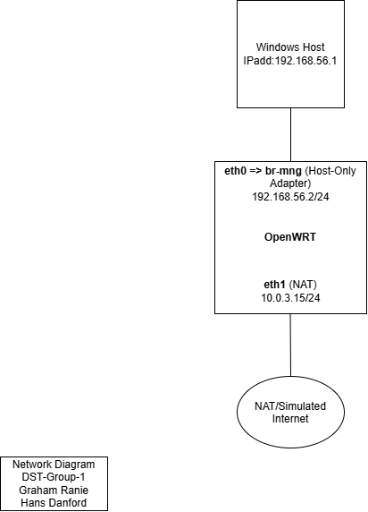
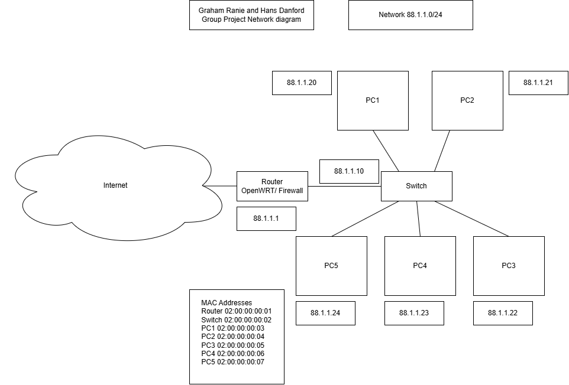

# Network Setup

## Assumptions

- **Business:** Rocky Accounting & Tax Practice. A Small accounting firm  (deals with sensitive client financial data, good fit for the risk assessment)
- **Staff:** 5 total
- **City:** Rockhampton, Australia
- **Staff roles:**
  1. Practice Manager (also handles admin)
  2. 2–3 Accountants/Tax Agents
  3. Bookkeeper
  4. IT Support (part-time)

- **Website content:** Services: Tax Preparation & Lodgement (individual and business returns, prepared accurately and on time), Bookkeeping & Payroll (day-to-day financial record-keeping so you can focus on running your business), and Business Advisory (practical guidance on budgeting, cash flow, and growth planning)

## OpenWRT and VirtualBox Setup

The OpenWRT VM has two interfaces. VirtualBox Adapter 2 is attached to NAT (MAC 08:00:27:6F:F5:F5, matching eth1), which receives 10.0.3.15/24 from VirtualBox's internal DHCP. This simulates OpenWRT's WAN/internet-facing connection and is not directly reachable from the Windows host. VirtualBox Adapter 1 is attached to a Host-only Adapter (MAC 08:00:27:E3:5F:8F, matching eth0), and eth0 is bridged into br-mng, which holds the static address 192.168.56.2/24. The Windows host's own Host-only network adapter sits on the same subnet at 192.168.56.1. Because both the host and OpenWRT's br-mng interface are on 192.168.56.0/24, the host can reach OpenWRT directly (confirmed via ARP resolution and successful ping) without needing NAT or routing — this is how the browser, SSH, and Wireshark capture traffic all reach the VM. 

### Below is the Lab Network Diagram

Here are the IP Address Allocations
| Device | Interface | IP Address | Adapter Type |
|---|---|---|---|
| Windows host | (host nic) | 192.168.56.1/24 | Host-only adapter |
| OpenWRT | eth1 (Virtual Adapter 2) | 10.0.3.15/24 | NAT |
| OpenWRT | eth0->br-mng (Virtual Adapter 1) | 192.168.56.2/24 | Host-only adapter |

## Firewall Configuration

Write your answere here.

## Production Network Design

GR - The network design is a WIP - Pending feedback and discuss with Hans

