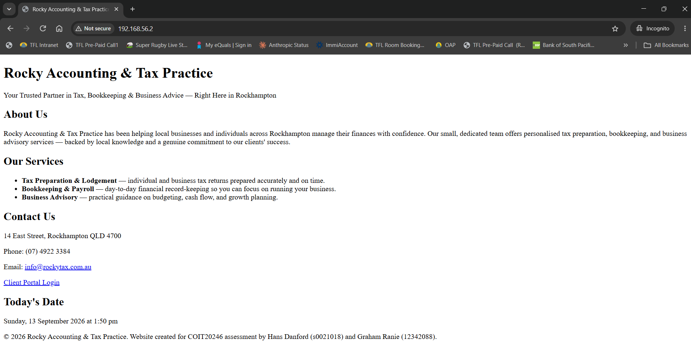
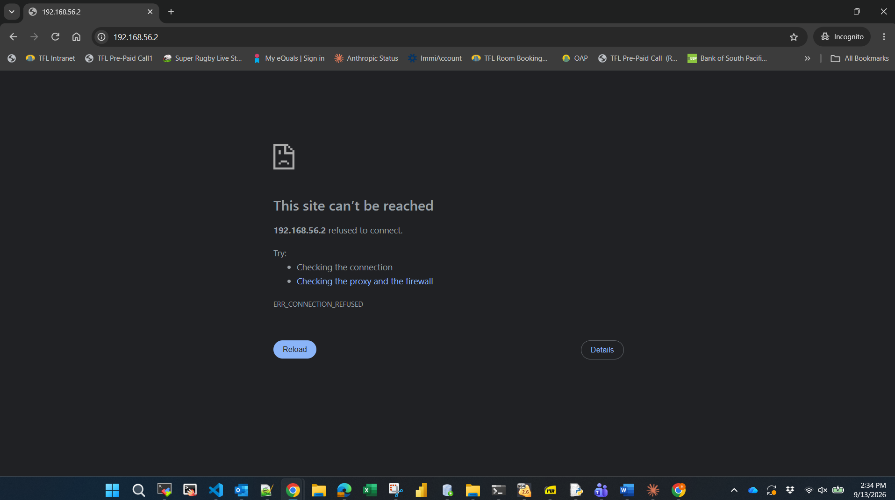
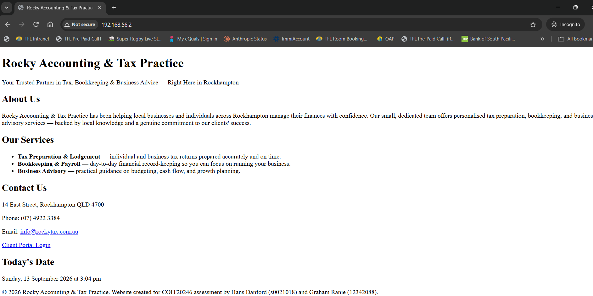
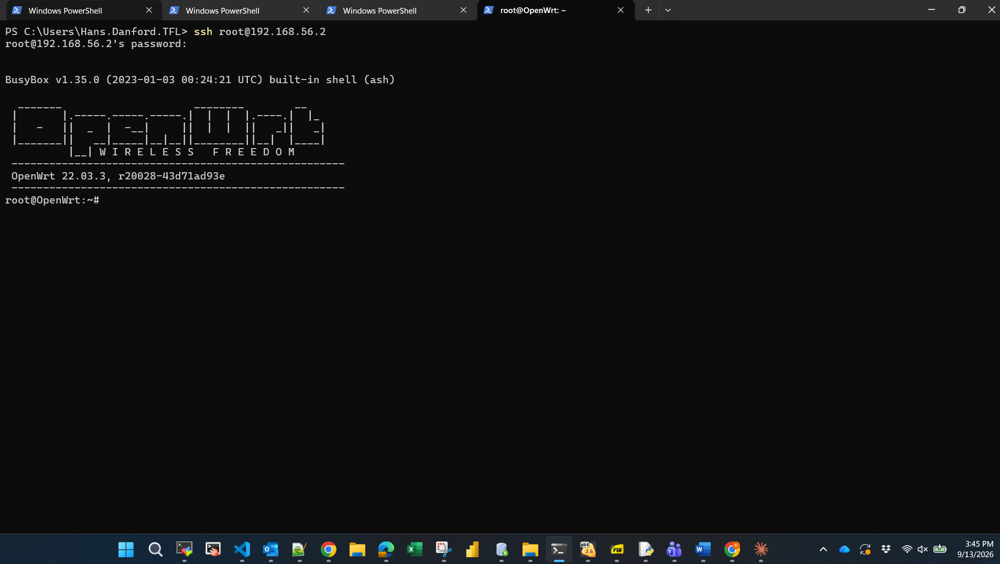
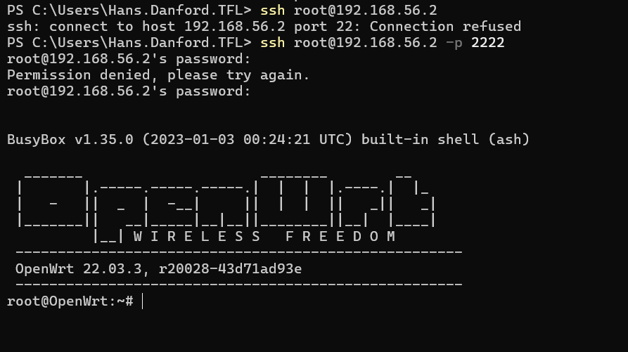

# Network Setup

## Assumptions

- **Business:** Rocky Accounting & Tax Practice. A Small accounting firm  (deals with sensitive client financial data, good fit for the risk assessment)
- **Staff:** 5 total
- **City:** Rockhampton, Australia
- **Staff roles:**
  1. Practice Manager (also handles admin)
  2. 2–3 Accountants/Tax Agents
  3. Bookkeeper
  4. IT Support (part-time)

- **Website content:** Services: Tax Preparation & Lodgement (individual and business returns, prepared accurately and on time), Bookkeeping & Payroll (day-to-day financial record-keeping so you can focus on running your business), and Business Advisory (practical guidance on budgeting, cash flow, and growth planning)

## OpenWRT and VirtualBox Setup

The OpenWRT VM has two interfaces. VirtualBox Adapter 2 is attached to NAT (MAC 08:00:27:6F:F5:F5, matching eth1), which receives 10.0.3.15/24 from VirtualBox's internal DHCP. This simulates OpenWRT's WAN/internet-facing connection and is not directly reachable from the Windows host. VirtualBox Adapter 1 is attached to a Host-only Adapter (MAC 08:00:27:E3:5F:8F, matching eth0), and eth0 is bridged into br-mng, which holds the static address 192.168.56.2/24. The Windows host's own Host-only network adapter sits on the same subnet at 192.168.56.1. Because both the host and OpenWRT's br-mng interface are on 192.168.56.0/24, the host can reach OpenWRT directly (confirmed via ARP resolution and successful ping) without needing NAT or routing — this is how the browser, SSH, and Wireshark capture traffic all reach the VM. 

### Below is the Lab Network Diagram


Here are the IP Address Allocations
| Device | Interface | IP Address | Adapter Type |
|---|---|---|---|
| Windows host | (host nic) | 192.168.56.1/24 | Host-only adapter |
| OpenWRT | eth1 (Virtual Adapter 2) | 10.0.3.15/24 | NAT |
| OpenWRT | eth0->br-mng (Virtual Adapter 1) | 192.168.56.2/24 | Host-only adapter |

## Firewall Configuration

### 1) Used the following commands to add firewall rule to Block HTTP traffic.

### Below is the screenshot of the web page before the firewall updates



```
root@OpenWrt:~# uci add firewall rule
cfg0f92bd
root@OpenWrt:~# uci set firewall.@rule[-1].name='Block-HTTP'
root@OpenWrt:~# uci set firewall.@rule[-1].src='lan'
root@OpenWrt:~# uci set firewall.@rule[-1].proto='tcp'
root@OpenWrt:~# uci set firewall.@rule[-1].dest_port='80'
root@OpenWrt:~# uci set firewall.@rule[-1].target='REJECT'
root@OpenWrt:~# uci commit firewall && /etc/init.d/firewall restart
```
The name of the rule is `Block-HTTP`. It will reject traffic on port 80 for "lan" network. Once the rule is set, the firewall needs to be restarted for the rule to take effect. Note: Initially it was assumed that the "lan" source was the network used for http traffic. This was not the case and a reload of the web page did not time out. A review of `uci show network` (output below) confirmed that the "mng" network carried the web page. Adding "mng" network to previously created firewall rule using `uci add_list firewall.@zone[0].network='mng'` followed by a restart of the firewall using `uci commit firewall && /etc/init.d/firewall restart`, finally resulted in the blocking of http traffic. Being able to block or allow HTTP traffic on demand means the business can take the website offline during maintenance or suspected compromise without shutting down the whole router.

```
root@OpenWrt:~# uci show network
network.loopback=interface
network.loopback.device='lo'
network.loopback.proto='static'
network.loopback.ipaddr='127.0.0.1'
network.loopback.netmask='255.0.0.0'
network.globals=globals
network.globals.ula_prefix='fd88:3563:c944::/48'
network.@device[0]=device
network.@device[0].name='br-lan'
network.@device[0].type='bridge'
network.@device[0].ports='eth0'
network.wan=interface
network.wan.device='eth1'
network.wan.proto='dhcp'
network.wan.ifname='eth1'
network.mng=interface
network.mng.proto='static'
network.mng.netmask='255.255.255.0'
network.mng.ipaddr='192.168.56.2'
network.mng.device='br-mng'
network.lan=interface
network.lan.proto='dhcp'
network.lan.device='eth2'
network.@device[1]=device
network.@device[1].name='br-mng'
network.@device[1].type='bridge'
network.@device[1].ports='eth0'
```

### Below is the screenshot of successfully blocked web page



### Unblock HTTP
To unblock the HTTP traffic the following command was issued `uci set firewall.@rule[-1].target='ACCEPT'` followed by a restart of the firewall. Resulting in HTTP traffic being allowed and web page being successfully displayed below.




### 2) SSH on port 2222

#### Below is a snapshot of successful ssh on port 22



OpenWRT uses Dropbear as its SSH server. Using the following command `uci show dropbear` we can see the SSH configuration on the router. Below is the output of that command.

```
root@OpenWrt:~# uci show dropbear
dropbear.@dropbear[0]=dropbear
dropbear.@dropbear[0].PasswordAuth='on'
dropbear.@dropbear[0].RootPasswordAuth='on'
dropbear.@dropbear[0].Port='22'
```
Using the `uci set dropbear.@dropbear[0].Port='2222'` command we can see that the ssh port has been configured to `2222`. After a restart of the service with `uci commit dropbear && /etc/init.d/dropbear restart`, we can see (below) that the configuration has been updated with the `show` command used previously.

```
root@OpenWrt:~# uci set dropbear.@dropbear[0].Port='2222'
root@OpenWrt:~# uci commit dropbear && /etc/init.d/dropbear restart
root@OpenWrt:~# uci show dropbear
dropbear.@dropbear[0]=dropbear
dropbear.@dropbear[0].PasswordAuth='on'
dropbear.@dropbear[0].RootPasswordAuth='on'
dropbear.@dropbear[0].Port='2222'
```
Apart from changing the port from 22 to 2222, a firewall rule called `Allow-SSH-2222` was also configured and deployed to explicitly allow traffic to reach port 2222. Changing the ssh port to 2222 defeats scanners hardcoded to hit port 22 and configuring the firewall also ensures that TCP traffic will continue to be allowed on port 2222 if existing TCP firewall rules change. It's also important to note that although I have changed the port 2222 on my existing SSH session, the change in configuration only affects new SSH connections. Below is a screenshot of unsuccessful ssh on port 22 and then successful ssh on port 2222.

Here's the firewall configuration:
```
root@OpenWrt:~# uci add firewall rule
cfg1092bd
root@OpenWrt:~# uci set firewall.@rule[-1].name='Allow-SSH-2222'
root@OpenWrt:~# uci set firewall.@rule[-1].src='lan'
root@OpenWrt:~# uci set firewall.@rule[-1].proto='tcp'
root@OpenWrt:~# uci set firewall.@rule[-1].dest_port='2222'
root@OpenWrt:~# uci set firewall.@rule[-1].target='ACCEPT'
root@OpenWrt:~# uci commit firewall && /etc/init.d/firewall restart
root@OpenWrt:~# uci show firewall
firewall.@rule[11]=rule
firewall.@rule[11].name='Allow-SSH-2222'
firewall.@rule[11].proto='tcp'
firewall.@rule[11].dest_port='2222'
firewall.@rule[11].target='ACCEPT'
firewall.@rule[11].src='lan'
```



## Production Network Design

GR - The network design is a WIP - Pending feedback and discuss with Hans


