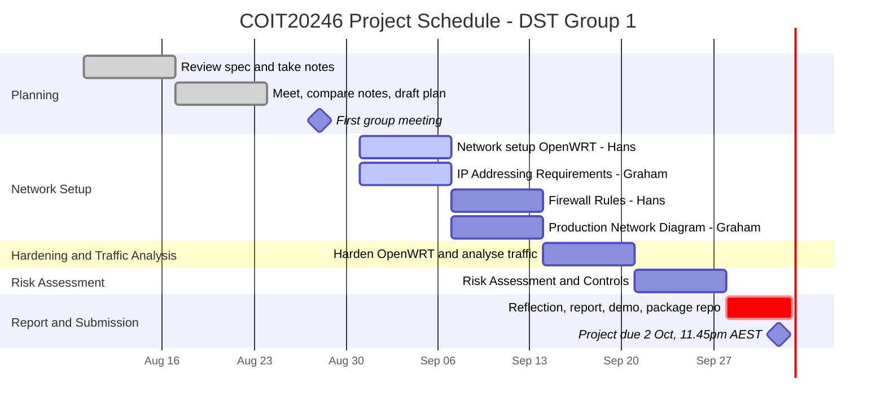

# Project Plan

## Key Dates

- **Project due:** Friday 2 October 2026, 11:45pm AEST (30% of unit grade)
- **plan.md required in GitHub:** by end of Week 6 (23 Aug 2026)

## Communication Plan

- **Frequency:** Weekly, every Friday evening.
- **Time:** ~5:00–6:00 pm AEST (Graham) / ~7:00–8:00 pm Fiji
- **Platform for calls:** Google Meet
- **First sync:** Friday 28 August 2026

## Schedule
The plan of tasks for each group member for the remainder of the project is:

- Week 5: We will each go through the assignment requirements and when we meet break down the requirements and create a plan.
- Week 6: Meet and go through the assignment requirements and notes we have taken. Prepare a plan for future weeks. Assumptions to be completed
- Week 7: Hans to setup the Network in Open WRT. Graham to complete IP Addressing Requirements 
- Week 8: Hans to complete Firewall Rules. Graham to complete the Network Diagram
- Week 9: Harden the WRT system. Capture and Analyse Network Traffic. Allocation TBD
- Week 10: Risk Assessment.  Allocation TBD
- Week 11: Reflection, written report and recorded demonstration.  Allocation TBD

## Schedule - WIP

## Schedule

## Assumptions

- **Business:** Small accounting firm  (deals with sensitive client financial data, good fit for the risk assessment)
- **Staff:** 5 total
- **City:** Rockhampton, Australia
- **Staff roles:**
  1. Practice Manager (also handles admin)
  2. 2–3 Accountants/Tax Agents
  3. Bookkeeper
  4. IT Support (part-time)

- **Website content (draft — not yet confirmed):** services offered (tax prep, bookkeeping, business advisory), staff bios, contact form, client portal login for document exchange.