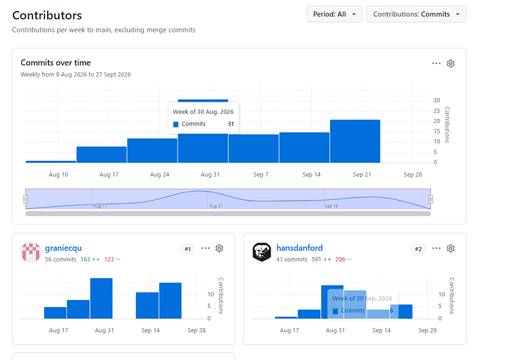
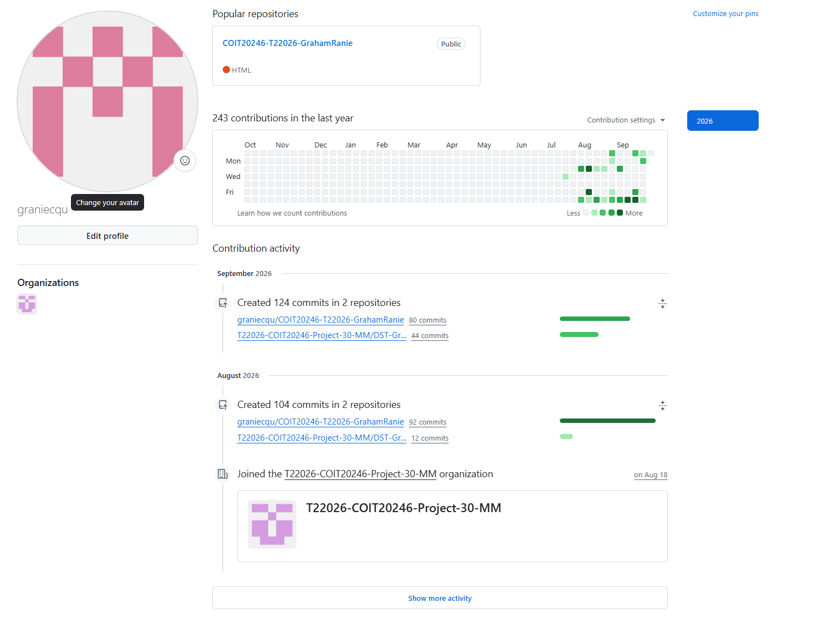
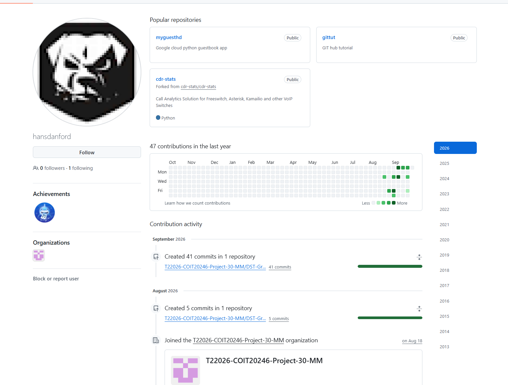

# Project Reflection

## GitHub Commits  
  
  
  
  
  
  
## List of Tasks
  
Harden - Hans did 100%  
Network - Hans did 80%, Graham did 20%  
Plan - Hans 50%, Graham 50%  
Risk Assessment - Graham did 80%, Hans did 20%  
Security controls - Graham did 100%  
Reflection - Graham did 50%, Hans did 50%  
Presentation - Graham did 50%, Hans did 50%  

## Reflection on Commits and Tasks
Reflect on GitHub commits, tasks performed and which weeks commits were made. See Project Specification for detailed requirements. 

## Reflection on Group Work
Discuss how you worked in a group, issues encountered and recommended techniques for future. See Project Specification for detailed requirements.
